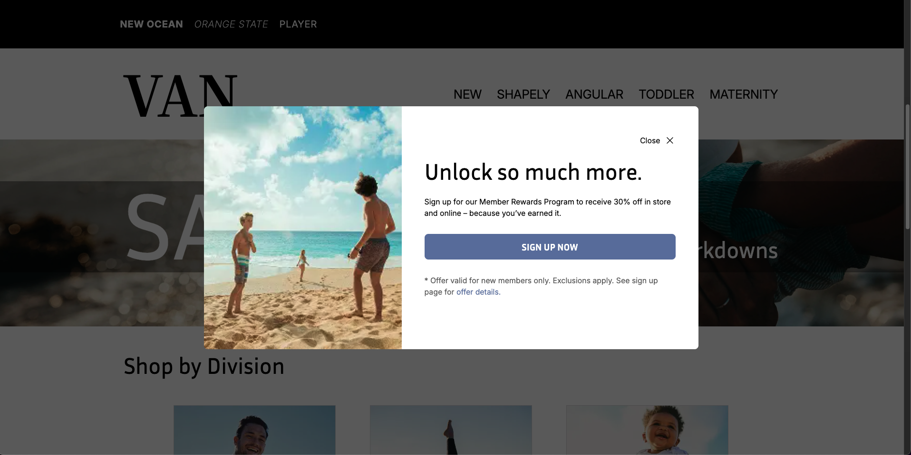
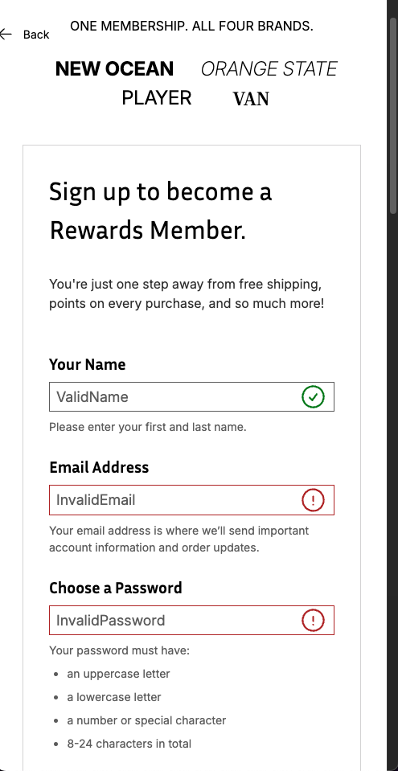

# responsive-fashion-website
A responsive, multi-page fashion retail website developed as part of my NAIT Web Development coursework. This project replicates a commercial-style layout with modal functionality, dynamic form validation, scrollable components, and accordions using HTML5, CSS3, and JavaScript.

## 🖼️ Screenshots

| Desktop View | Mobile View |
|--------------|-------------|
|  |  | 

## 🚀 Live Demo

[View on GitHub Pages](https://tsohnle95.github.io/van-shoppe-fashion-website)

## 🧵 Project Overview

This project focused on recreating a fully responsive retail experience based on a provided Figma design. The site includes a modal that appears on load, a horizontally scrollable product section, a dynamic form with validation states, and an accordion FAQ component.

## 🔧 Technologies Used

- HTML5  
- CSS3 (including media queries & flexbox)  
- JavaScript  

## 📄 Features

- Fully responsive layout for mobile and desktop  
- Modal window triggered after page load
- Horizontally scrolling product view section
- Form with client-side validation and conditional visual feedback 
- Interactive accordion for FAQs
- Clean semantic structure and utility-based class naming

## 📝 Credits

Built using a provided Figma design reference.
